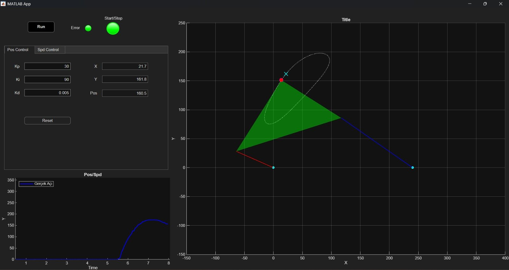
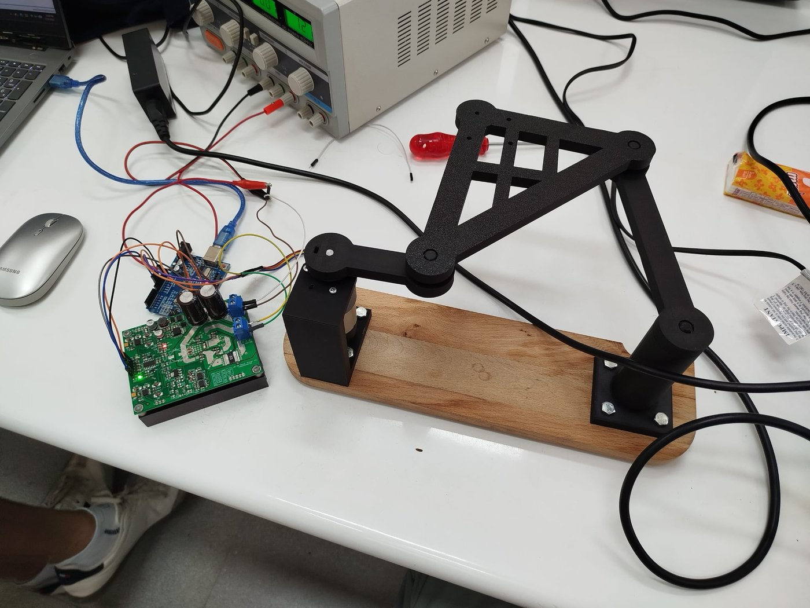
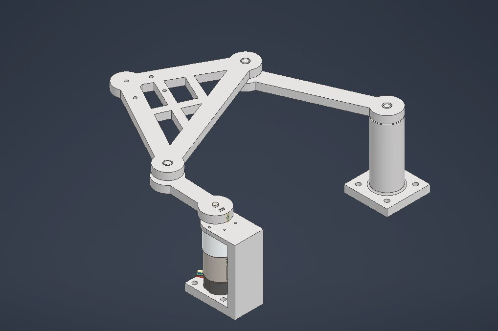
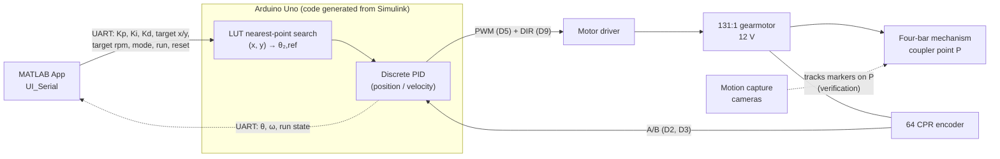
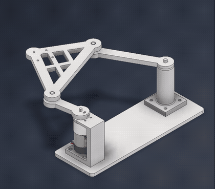
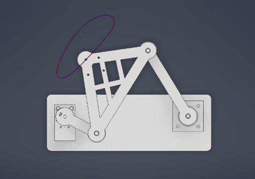
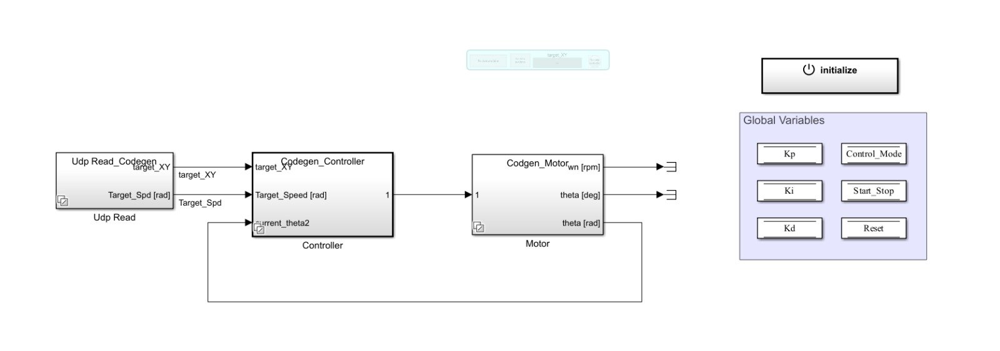
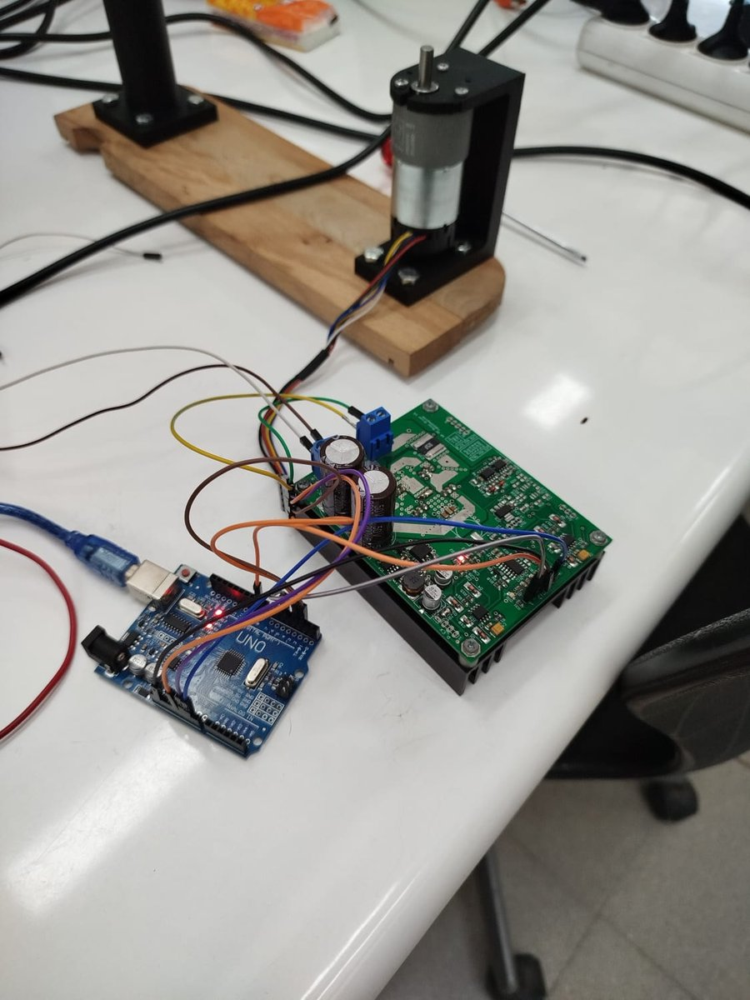
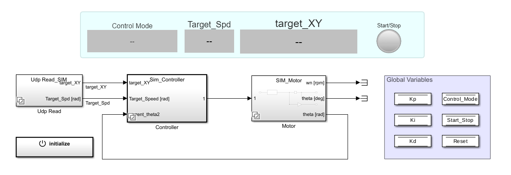
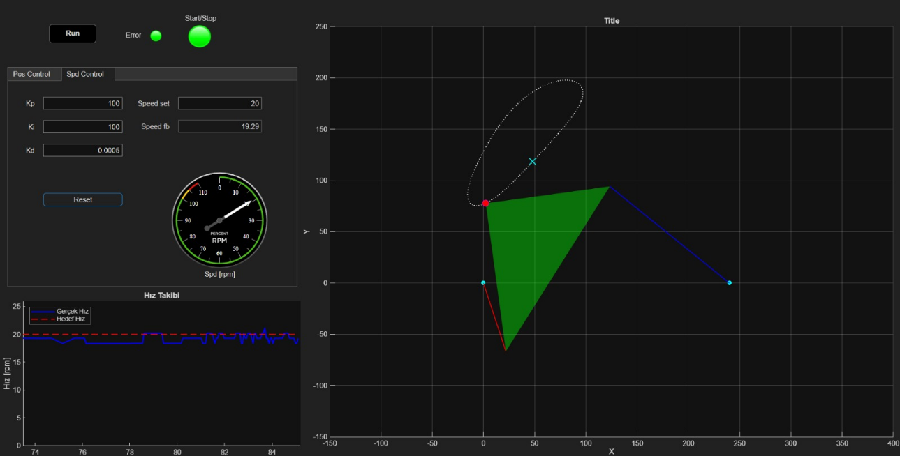

# Four-Bar Mechanism Real-Time Control

Real-time PID **position** and **velocity** control of a 1-DOF crank-rocker four-bar mechanism: the controller is designed in Simulink, deployed to an Arduino, and tuned live from a custom MATLAB App over UART, with no redeployment needed.

[](https://www.mathworks.com/products/matlab.html)
[](https://www.mathworks.com/products/simulink.html)
[](https://www.arduino.cc/)
[](LICENSE)

<p align="center">
  
  <br><em>The control app in position mode. Left: live PID gains, target and measured crank angle. Right: the mechanism's current configuration, the coupler-point path (dotted) and the selected target (×).</em>
</p>

---

## Table of Contents

- [Overview](#overview)
- [Features](#features)
- [System Architecture](#system-architecture)
- [Mechanism Parameters](#mechanism-parameters)
- [Kinematics](#kinematics)
- [Control Strategy](#control-strategy)
- [Hardware](#hardware)
- [Repository Structure](#repository-structure)
- [Getting Started](#getting-started)
- [Results](#results)
- [Team](#team)
- [Acknowledgments](#acknowledgments)
- [License](#license)

## Overview

<table>
  <tr>
    <td width="50%"></td>
    <td width="50%"></td>
  </tr>
  <tr>
    <td align="center"><em>Manufactured prototype</em></td>
    <td align="center"><em>CAD model (Autodesk Inventor)</em></td>
  </tr>
</table>

**Problem.** A crank-rocker four-bar linkage turns the crank rotation θ₂ into a closed coupler-point curve. The task: given a desired position of the coupler point **P**, drive the mechanism there and hold it, or run the crank at a commanded speed.

**Approach.**

1. The crank angle θ₂ is swept over [0°, 360°). For every sample, forward kinematics gives the coupler point P, and the triple (θ₂, Pₓ, P_y) is stored in a **look-up table (LUT)**.
2. In the MATLAB App the user clicks (or drags) on the drawn trajectory. The app snaps the click to the nearest point on the path and sends the target (x, y) to the Arduino.
3. On the Arduino, the nearest LUT entry (Euclidean distance) gives the reference θ₂. A discrete PID controller then drives the gearmotor to that angle along the shortest way around.
4. The PID gains (Kp, Ki, Kd), the control mode and the run/stop command are streamed from the app over UART, so the gains can be retuned **while the controller is running**.
5. A lab motion-capture system tracks reflective markers on the coupler point to verify the real position.

**Why it is interesting.** It is a complete, small mechatronics loop: mechanism synthesis → CAD and manufacturing → model-based controller design → embedded code generation → a custom real-time HMI with its own binary protocol. The mechanism moves **point to point** instead of rotating continuously, and a separate velocity mode regulates the crank speed.

## Features

- **Live PID tuning.** Kp, Ki and Kd are edited in the app and sent to the Arduino every 50 ms. No rebuild or redeploy is needed.
- **Point-to-point position control.** Click a point on the coupler curve and the mechanism moves there (LUT-based target selection with shortest-path phase wrapping).
- **Velocity control.** A separate tab regulates the crank speed (set point in rpm) with its own PID gains and an RPM gauge.
- **Animated GUI.** The current linkage configuration is redrawn from the encoder feedback, together with the reference path, the target marker and a live time plot of angle or speed.
- **Robust serial link.** Framed binary packets (`0xAA … 0x55`), an XOR checksum on the feedback packet, buffer resynchronisation, and a link-loss indicator (*Error* lamp turns red after 1 s without data).
- **PID reset.** A *Reset* button resets the PID controller's internal states on the Arduino.
- **Motion-capture verification.** Reflective markers on the coupler point are tracked by the lab's motion-capture cameras.
- **Simulation variants.** The Simulink model has `(sim)` variants: a DC-motor plant model plus a UDP link to `UI_UDP`, for desktop testing without hardware (see [Simulation mode](#simulation-mode-no-hardware)).

## System Architecture



### Serial protocol

| Direction | Size | Layout | Rate |
|---|---|---|---|
| App → Arduino | 29 B | `0xAA` · Kp · Ki · Kd · target X · target Y · target rpm *(6 × single)* · mode · run · reset *(3 × uint8)* · `0x55` | every 50 ms while *Run* is on, and on every button press |
| Arduino → App | 12 B | `0xAA` · θ [rad] · ω [rad/s] *(2 × single)* · run state *(uint8)* · XOR checksum of bytes 2–10 · `0x55` | 50 ms |

The default link is **9600 baud** on `Serial0` (USB). The value in [`config.m`](config.m) must match the model.

## Mechanism Parameters

| Symbol | Link | Value |
|---|---|---|
| a | Crank (input, driven by the motor) | 70 mm |
| b | Coupler | 190 mm |
| c | Rocker | 150 mm |
| d | Ground | 240 mm |
| α | Coupler triangle angle at joint A | 40° |
| β | Coupler triangle angle at joint B | 50° |
| L_AP | Distance A → P (from the code: `b·cos α`) | ≈ 145.55 mm |

**Grashof check.** With s = 70 (shortest), l = 240 (longest), p = 190, q = 150:

$$
s + l = 70 + 240 = 310 \;\le\; p + q = 190 + 150 = 340
$$

The linkage is Grashof, and because the **shortest link is the crank** (adjacent to the ground), it is a **crank-rocker**: the crank can rotate fully while the rocker oscillates.

<p align="center">
  
  
  <br><em>Coupler-point path from the Autodesk Inventor dynamic simulation (full video: <a href="media/inventor_trajectory_simulation.mp4">media/inventor_trajectory_simulation.mp4</a>).</em>
</p>

## Kinematics

The ground pivot of the crank O₂ is at the origin, and the rocker pivot O₄ is at (d, 0). Using the Freudenstein-type coefficients derived from the loop-closure equation:

$$
A = 2c\,(d - a\cos\theta_2), \qquad
B = -2ac\sin\theta_2, \qquad
C = a^2 - b^2 + c^2 + d^2 - 2ad\cos\theta_2
$$

$$
A\cos\theta_4 + B\sin\theta_4 + C = 0
$$

The tangent half-angle substitution gives the rocker angle:

$$
\theta_4 = 2\,\mathrm{atan2}\left(-B - \sqrt{A^2 + B^2 - C^2},\; C - A\right)
$$

> **Branch used.** The code (`init_kinematics.m`, `FourBar_Visualizer_handle.m`) uses the **minus** sign (`m = 1`, labelled "crossed mode" in the code comments). In this assembly branch the rocker tip B stays **above** the ground line (θ₄ ≈ 100°…156° over a full crank turn). The other branch (+) is its mirror image below the ground line.
>
> The term under the square root is **A² + B² − C²**. The project report prints "+C²" there, which is a typo; the code uses the correct form.

Joint coordinates and coupler angle:

$$
A_x = a\cos\theta_2,\quad A_y = a\sin\theta_2,\qquad
B_x = d + c\cos\theta_4,\quad B_y = c\sin\theta_4
$$

$$
\theta_3 = \mathrm{atan2}\left(B_y - A_y,\; B_x - A_x\right)
$$

Coupler point P:

$$
P_x = A_x + L_{AP}\cos(\theta_3 + \alpha), \qquad
P_y = A_y + L_{AP}\sin(\theta_3 + \alpha)
$$

with $L_{AP} = b\cos\alpha = 190\cos 40^\circ \approx 145.55$ mm. This is the same as $b\sin\beta / \sin(180^\circ - \alpha - \beta) = 190\sin 50^\circ$, i.e. the coupler triangle has a right angle at P.

**LUT search.** For a target $(x_t, y_t)$:

$$
\theta_{2,\text{target}} = \arg\min_{\theta_{2,i}} \sqrt{(P_{x,i} - x_t)^2 + (P_{y,i} - y_t)^2}
$$

On the Arduino the squared distance is minimised (same arg-min, no square root). The result is then phase-wrapped so the crank takes the shortest way round:

$$
\Delta\theta = \mathrm{mod}\left(\theta_{2,\text{target}} - \theta_2 + \pi,\; 2\pi\right) - \pi, \qquad
\theta_{2,\text{ref}} = \theta_2 + \Delta\theta
$$

| LUT | Samples | Where |
|---|---|---|
| Embedded LUT (`theta2_LUT`, `Px_LUT`, `Py_LUT`, single precision) | 100 points over [0, 2π] | Model workspace of `realtime_controller.slx`; generated by `init_kinematics.m` |
| GUI path | 360 points | `FourBar_Visualizer_handle.m` (drawing and click snapping) |

## Control Strategy

### Why a look-up table?

P depends only on θ₂, so the reachable targets form a single closed curve. Solving the inverse kinematics on every request would mean solving the coupler-curve equation for θ₂. Also, a user's click is generally not exactly on the curve. With a precomputed LUT, target selection becomes a nearest-neighbour search: 100 multiply-adds with no trigonometry. That is cheap enough for an 8-bit AVR and automatically projects any click onto the nearest reachable point.

### PID loop (on the Arduino)

- **Controller.** A Simulink *PID Controller* block, discrete-time, parallel form, Forward-Euler integrator and derivative filter. Its gains are **external inputs** read from data stores that the serial receiver updates, which is what makes live tuning possible. The derivative filter coefficient is N = 100. The integrator is clamped (anti-windup), and an external reset is wired to the GUI's *Reset* button.
- **Actuation.** The PID output is saturated to ±254. Its magnitude drives **PWM on D5**, and its sign drives the **direction pin D9**. The output is forced to 0 when *Run* is off.
- **Feedback.** Arduino encoder block on D2/D3 (quadrature counts), converted to the crank angle by

  $$\theta = \text{counts}\cdot\frac{1}{64}\cdot 2\pi\cdot\frac{1}{102}\ \text{rad}$$

  <!-- TODO: confirm the 1/102 factor (6528 counts per output revolution). A 131:1 gearbox with a 64 CPR encoder would suggest ≈ 8400 counts/rev; state whether 102 is an experimentally calibrated value or a different gear ratio. -->

  The speed is estimated by a first-order filtered backward difference, $\omega_k = a\,\frac{\theta_k - \theta_{k-1}}{T_s} + (1-a)\,\omega_{k-1}$, with $T_s = 0.01$ s and $a = 1$ in the stored model workspace (i.e. currently unfiltered).
- **Timing.** Fixed-step solver, $T_s = 0.01$ s. Serial receive and transmit run at 0.05 s.

### Position vs. velocity mode

| | Position mode (*Pos Control* tab) | Velocity mode (*Spd Control* tab) |
|---|---|---|
| Reference | θ₂,ref from the LUT search + phase wrapping | Speed set point [rpm] × π/30 → rad/s |
| Feedback | θ [rad] | ω [rad/s] |
| Gains | Pos-tab Kp, Ki, Kd | Spd-tab Kp, Ki, Kd |
| GUI plot | Measured angle [deg] | Measured vs. target speed [rpm] |

The active tab selects the mode (the `mode` byte in the packet). Both modes share the same PID block, whose gains are swapped by the app.

<p align="center">
  
  <br><em>Top level of <code>simulink/realtime_controller.slx</code> (code-generation variants active). The <code>Controller</code> variant contains the serial receive/transmit, encoder, LUT search and PID blocks.</em>
</p>

## Hardware

### Bill of materials

| Item | Specification | Qty |
|---|---|---|
| Microcontroller | Arduino Uno (target board set in the Simulink model) | 1 |
| Gearmotor | 131:1 metal gearmotor, 37D × 73L mm, 12 V, 64 CPR magnetic encoder | 1 |
| Motor driver | <!-- TODO: motor driver model --> TODO | 1 |
| Power supply | 12 V <!-- TODO: supply model / current rating --> | 1 |
| Mechanism | Crank, triangular coupler, rocker, base plate and motor mount (see [Overview](#overview)) <!-- TODO: material and manufacturing method --> | 1 set |
| Reflective markers | For motion capture, mounted on the coupler point <!-- TODO: number and size --> | TODO |
| Motion capture system | Laboratory cameras <!-- TODO: system name / model --> | — |

### Pin assignment (read from the Simulink model)

| Signal | Arduino pin | Simulink block |
|---|---|---|
| Encoder channel A | D2 | Arduino *Encoder* |
| Encoder channel B | D3 | Arduino *Encoder* |
| Motor PWM | D5 (≈ 490 Hz) | Arduino *PWM* |
| Motor direction | D9 | Arduino *Digital Output* |
| Serial link to PC | Serial0 (USB), 9600 baud | *Serial Receive* / *Serial Transmit* |

<!-- TODO: motor driver input pins (e.g. PWM/DIR/EN), encoder supply wiring and motor power wiring -->

<p align="center">
  
</p>

## Repository Structure

```
FourBar-RealTimeControl-ModelBasedDesign/
├── README.md
├── LICENSE
├── .gitignore
├── setup_paths.m                  # adds matlab/ and simulink/ to the MATLAB path
├── config.m                       # serial port, baud rate, UDP ports (one place)
├── matlab/
│   ├── app/
│   │   ├── UI_Serial.mlapp        # hardware GUI, App Designer source
│   │   ├── UI_Serial_exported.m   # hardware GUI, runnable export (newest code)
│   │   ├── UI_UDP.mlapp           # simulation GUI (UDP), App Designer source
│   │   ├── UI_UDP_exported.m      # simulation GUI, runnable export
│   │   └── FourBar_Visualizer_handle.m  # kinematics, animation and click-to-target
│   └── kinematics/
│       └── init_kinematics.m      # forward kinematics → 100-point LUT
├── simulink/
│   └── realtime_controller.slx    # PID controller model for Arduino Uno
├── docs/
│   └── images/                    # README figures
└── media/
    └── inventor_trajectory_simulation.mp4
```

## Getting Started

### Requirements

| Software | Notes |
|---|---|
| MATLAB **R2025b** | The model and apps were saved with R2025b Update 5. Older releases are untested. <!-- TODO: verify minimum release --> |
| Simulink | |
| Simulink Support Package for Arduino Hardware | Encoder, PWM, Digital Output and Serial blocks; build & deploy |
| Aerospace Toolbox | Used by the app's RPM gauge (`Aero.ui.control.RPMIndicator`) |
| Instrument Control Toolbox | Only for [simulation mode](#simulation-mode-no-hardware) (UDP blocks and `udpport`) <!-- TODO: verify --> |
| Other | <!-- TODO: verify whether Embedded Coder / Simulink Coder licences are required (model uses ert.tlc), and which product provides the Byte Pack / Byte Unpack blocks --> |

### Steps (hardware)

1. **Clone** the repository and open MATLAB in the repository folder.
2. **Add the paths:**
   ```matlab
   setup_paths
   ```
3. **Set the COM port** of your Arduino in [`config.m`](config.m) (`cfg.serial_port`). Leave `cfg.baud_rate = 9600` unless you also change it in the model. To list ports, use `serialportlist("available")`.
4. **Open the model** `simulink/realtime_controller.slx`. In *Hardware Settings → Hardware Implementation*, select **Arduino Uno** and set the **Host-board connection COM port**. The model is saved with `COM9`.
5. **Build & Deploy.** On the *Hardware* tab, click **Build, Deploy & Start**. Close the app first: the Arduino Uno uses the same USB serial port for upload and for the app link.
6. **Open the app:**
   ```matlab
   UI_Serial_exported        % runnable export (most recent code)
   % or: appdesigner('UI_Serial.mlapp') to edit, see note below
   ```
   The *Error* lamp turns green once feedback packets arrive.
7. **Run.**
   - **Position:** in the *Pos Control* tab, enter Kp/Ki/Kd and click or drag on the dotted trajectory to select a target (×).
   - **Velocity:** in the *Spd Control* tab, enter the gains and a *Speed set* value in rpm.
   - Toggle **Run** to enable the motor. The **Start/Stop** lamp is driven by the run state the Arduino echoes back: green = running, red = stopped. Toggle *Run* off to stop.
   - Gains can be changed at any time while running. *Reset* resets the PID states.

> **Note on the `.mlapp` files.** `UI_Serial_exported.m` is newer than `UI_Serial.mlapp`: it has an improved close handler (timer and serial cleanup), and it reads the port from `config.m`. The `.mlapp` sources still contain the original hardcoded `COM9` / UDP ports. <!-- TODO: bring the .mlapp files in line with the exported versions in App Designer -->

> **Changing the geometry.** The LUT used on the Arduino lives in the **model workspace** (`Px_LUT`, `Py_LUT`, `theta2_LUT`, 100 points). `init_kinematics.m` regenerates the same arrays in the base workspace. Copy them into the model workspace (Model Explorer) after editing the link lengths, and update the constants in `FourBar_Visualizer_handle.m` to match.

### Simulation mode (no hardware)

The model's `Udp Read`, `Controller` and `Motor` blocks are *sim/codegen* variant subsystems. In a normal desktop simulation, the `(sim)` variants are active: a DC-motor plant model (parameters `R`, `L`, `Kt`, `J`, `B` in the model workspace) and a UDP link (`127.0.0.1`, ports 5004/5005) to `UI_UDP_exported`.

<p align="center">
  
  <br><em>Model top level with the <code>(sim)</code> variants active.</em>
</p>

<!-- TODO: the (sim) variant references an enumeration `ControlMode` (PositionControl / SpeedControl) whose class definition is not in this repository; add ControlMode.m or document how simulation mode is started. -->

### Troubleshooting

| Symptom | Likely cause / fix |
|---|---|
| `UART AÇILAMADI!` / "port is busy" when the app starts | Another program holds the port: Arduino IDE Serial Monitor, a second app instance, or a leftover `serialport` object. Close it, or run `delete(serialportfind)`. The app cannot be open during **Build & Deploy**. |
| Deploy fails with a COM-port error | The model is saved with `COM9`. Set the correct port in *Hardware Settings → Host-board connection*. |
| *Error* lamp stays red / garbled values | **Baud rate mismatch**: `cfg.baud_rate` in `config.m` must equal the model's `Serial0` baud rate (9600). Also check that the Arduino is running the deployed model. |
| `Undefined function 'FourBar_Visualizer_handle'` or `'config'` | Run `setup_paths` first. |
| Mechanism moves the wrong way or angle drifts | Check the encoder A/B wiring (D2/D3) and the motor polarity against the direction pin (D9). |

## Results

<table>
  <tr>
    <td width="50%"></td>
    <td width="50%"></td>
  </tr>
  <tr>
    <td align="center"><em>Position control: the mechanism moves to the selected target point; the lower plot shows the measured crank angle.</em></td>
    <td align="center"><em>Velocity control: measured speed (blue) vs. set point (red dashed) on the speed gauge and time plot.</em></td>
  </tr>
</table>

The screenshots are from the project report (*"At any t time"*). They show the gains entered at that moment; they are not tuned final values.

<!-- TODO: add quantitative results (e.g. rise time, overshoot, steady-state error) only if they were measured. -->
<!-- TODO: motion-capture verification: no measurement data is included in this repository yet. Add the exported marker data under data/ and a plot comparing the measured coupler-point position with the LUT target. -->

## Team

MEE428 Real-Time Control, Group 03.

| Name | GitHub | Role |
|---|---|---|
| Hüseyin Kaya | <!-- TODO: @username --> | <!-- TODO: role --> |
| Kutay Kırtaş | <!-- TODO: @username --> | <!-- TODO: role --> |
| Müslüm Can Kandamar | [@MCanKandamar](https://github.com/MCanKandamar) | <!-- TODO: role --> |
| Ömer Güzel | <!-- TODO: @username --> | <!-- TODO: role --> |
| Eray Karagöz | <!-- TODO: @username --> | <!-- TODO: role --> |

## Acknowledgments

- **MEE428 Real-Time Control**, İzmir Kâtip Çelebi University. The mechanism dimensions are from the Group 3 dataset provided for the course project.
- Course instructor: <!-- TODO: instructor name -->
- The university laboratory, for access to the motion-capture system.

## License

This project is licensed under the **MIT License**. See [`LICENSE`](LICENSE).
